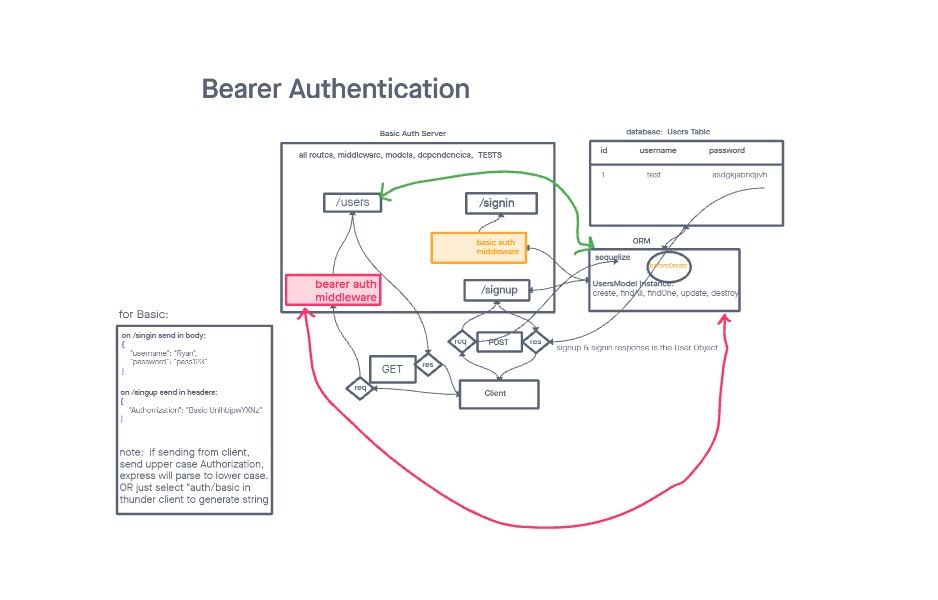

# LAB - Class 06

## Project: Auth

### Author: Martin Hansen

### Problem Domain

make a basic server with auth

### Links and Resources

- [GitHub Actions ci/cd](http://xyz.com)

### Setup

#### `.env` requirements (where applicable)

PORT=3000
DATABASE_URL=postgres://localhost:5432/basic-auth

#### How to initialize/run your application (where applicable)

- `npm start`

#### Features / Routes

- Feature One: Auth

#### Tests

fill this in as you see fit

- npm test

#### UML

